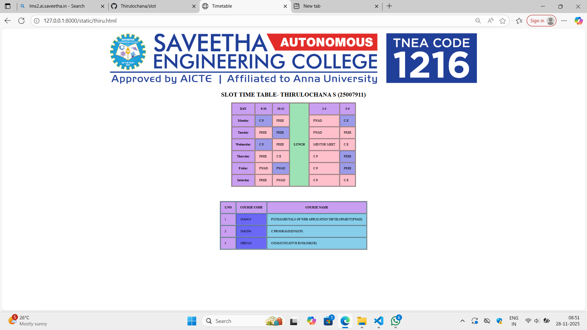

# Ex02 Time Table
## Date:28/11/2025

## AIM
To write a html webpage page to display your slot timetable.

## ALGORITHM
### STEP 1
Create a Django-admin Interface.

### STEP 2
Create an App inside the Django project.

### STEP 2
Create a static folder uder the created App and insert HTML code.

### STEP 3
Create a simple table using ```<table>``` tag in html with the relevant attributes.

### STEP 4
Add rows using ```<tr>``` tag.

### STEP 5
Add your course schedule using ```<td>``` tag.

### STEP 6
Execute the program using runserver command.

## PROGRAM
```
<html>

<head>
    <title>
        Timetable
    </title>
</head>

<body>

    <center>
        
    </center>

    <table border="1px" cellpadding="20px" cellspacing="3px" align="center" bgcolor="pink">

        <center>
            <h1>SLOT TIME TABLE- THIRULOCHANA S (25007911) </h1>

        </center>

        <tr style="background-color: rgb(201, 159, 241);">
            <th>DAY </th>
            <th>8-10</th>
            <th>10-12</th>
            <th rowspan="7" style="background-color: rgb(157, 226, 180);">LUNCH</th>
            <th>1-3</th>
            <th>3-5</th>
        </tr>
        <tr>
            <th style="background-color: rgb(201, 159, 241);">Monday</th>
            <td style="background-color: rgb(156, 155, 233);">C P</td>
            <td>FREE</td>
            <td>FWAD</td>
            <td style="background-color: rgb(156, 155, 233);">C E</td>
        </tr>
        <tr>
            <th style="background-color: rgb(201, 159, 241);">Tuesday</th>
            <td>FREE</td>
            <td style="background-color: rgb(156, 155, 233);">FREE</td>
            <td>FWAD</td>
            <td>FREE</td>
        </tr>
        <tr>
            <th style="background-color: rgb(201, 159, 241);">Wednesday</th>
            <td style="background-color: rgb(156, 155, 233);">C P</td>
            <td>FREE</td>
            <td>MENTOR MEET</td>
            <td>C E</td>
        </tr>
        <tr>
            <th style="background-color: rgb(201, 159, 241);">Thursday</th>
            <td>FREE</td>
            <td>C E</td>
            <td>C P</td>
            <td style="background-color: rgb(156, 155, 233);">FREE</td>
        </tr>
        <tr>
            <th style="background-color: rgb(201, 159, 241);">Friday</th>
            <td>FWAD</td>
            <td style="background-color: rgb(156, 155, 233);">FWAD</td>
            <td>C P</td>
            <td style="background-color: rgb(156, 155, 233);">FREE</td>
        </tr>
        <tr>
            <th style="background-color: rgb(201, 159, 241);">Saturday</th>
            <td>FREE</td>
            <td>FWAD</td>
            <td>C P</td>
            <td>C E</td>
        </tr>
    </table>
    <table style="margin-top: 2cm;" border="1px" cellpadding="20px" cellspacing="3px" align="center" bgcolor="skyblue">
        <tr bgcolor="white">
            <th style="background-color: rgb(201, 159, 241);">S.NO</th>
            <th style="background-color: rgb(201, 159, 241);">COURSE CODE</th>
            <th style="background-color: rgb(201, 159, 241);">COURSE NAME</th>
        </tr>
        <tr>
            <td style="background-color: rgb(201, 159, 241);">1</td>
            <td style="background-color: rgb(106, 104, 245);">19AI414</td>
            <td>FUNDAMENTALS OF WEB APPLICATION DEVELOPMENT(FWAD)</td>
        </tr>
        <tr>
            <td style="background-color: rgb(201, 159, 241);">2</td>
            <td style="background-color: rgb(106, 104, 245);">19AI304</td>
            <td>C PROGRAMMING(CP)</td>
        </tr>
        <tr>
            <td style="background-color: rgb(201, 159, 241);">3</td>
            <td style="background-color: rgb(106, 104, 245);">19EN101</td>
            <td>COMMUNICATIVE ENGLISH(CE)</td>
        </tr>
    </table>
</body>

</html>
```

## OUTPUT


## RESULT
The program for creating slot timetable using basic HTML tags is executed successfully.
